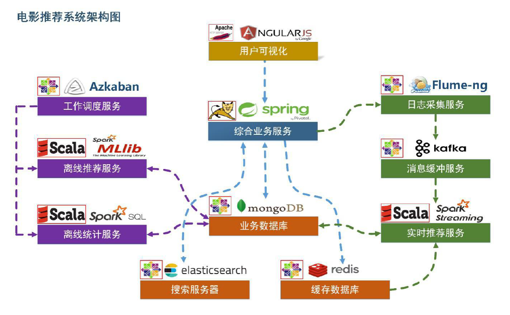

# 电影推荐系统(Movie Recommend System)

### 项目架构设计(Project Architecture Design):

### 项目组件:

- Flume: 1.7.0
- Tomcat:  8.5.23
- Elasticsearch: 5.6.2
- MongoDB: 3.4.3
- Kafka: 2.12
- Redis: 4.0.2
- Spark: 2.1.1

### 推荐系统：

1. #### [离线推荐部分(Offline)](https://github.com/Yifan122/RecommendSystem/tree/master/recommender/statisticsRecommender)

   ​    **离线统计服务**： 批处理统计性业务采用Spark Core + Spark SQL 进行实现，实现对指标类数据的统计任务。 
        **离线推荐服务**： 离线推荐业务采用Spark Core + Spark MLlib 进行实现，采用ALS 算法进行实现。 
   ​    **工作调度服务**： 对于离线推荐部分需要以一定的时间频率对算法进行调度， 采用Azkaban 进行任务的调度。

2. #### 实时推荐部分(Online Recommender System)

   ​    **日志采集服务**： 通过利用Flume-ng 对业务平台中用户对于电影的一次评分行为进行采集，实时发送到Kafka 集群。 
   ​    **消息缓冲服务**： 项目采用Kafka 作为流式数据的缓存组件， 接受来自Flume 的数据采集请求。并将数据推送到项目的实时推荐系统部分。 
   ​    **实时推荐服务**： 项目采用Spark Streaming 作为实时推荐系统，通过接收Kafka 中缓存的数据， 通过设计的推荐算法实现对实时推荐的数据处理， 并将结构合并更新到MongoDB 数据
   库。

### 数据模型：

1. Movie表（从testfiles/movies.csv 中导入）

   | 字段名   | 字段类型 | 字段描述     |
   | -------- | -------- | ------------ |
   | mid      | int      | 电影的ID     |
   | name     | String   | 电影的名称   |
   | desci    | String   | 电影的描述   |
   | timelong | String   | 电影时长     |
   | shoot    | String   | 电影拍摄时间 |
   | issue    | String   | 电影发布时间 |
   | language | String   | 电影语言     |
   | genres   | String   | 电影所属类别 |
   | director | String   | 电影导演     |
   | actors   | String   | 电影演员     |

   
   
2. Rating表（用户评分表，从testfiles/ratings.csv中导入）

   | 字段名    | 字段类型 | 字段描述   |
   | --------- | -------- | ---------- |
   | uid       | int      | 用户的ID   |
   | mid       | int      | 电影的ID   |
   | score     | double   | 电影的评分 |
   | timestamp | long     | 评分的时间 |

   

3. Tag表（标签表，从testfiles/tags.csv中导入）

   | 字段名    | 字段类型 | 字段描述   |
   | --------- | -------- | ---------- |
   | uid       | int      | 用户的ID   |
   | mid       | int      | 电影的ID   |
   | tag       | String   | 电影的标签 |
   | timestamp | long     | 评分的时间 |

### 