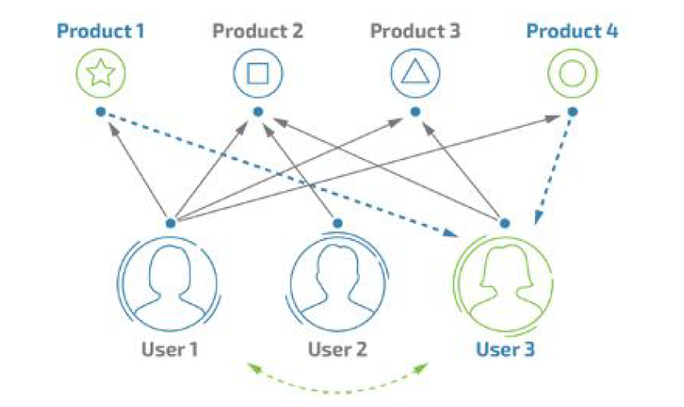
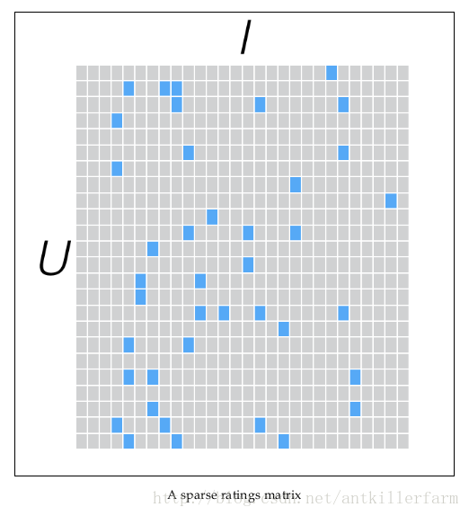
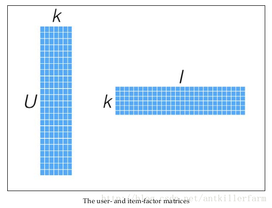

# 离线推荐服务（协同过滤）

## **协同过滤原理**

协同过滤推荐算法是诞生最早，并且较为著名的推荐算法。主要的功能是预测和推荐。算法通过对用户历史行为数据的挖掘发现用户的偏好，基于不同的偏好对用户进行群组划分并推荐品味相似的商品。协同过滤推荐算法分为两类，分别是基于用户的协同过滤算法(user-based collaboratIve filtering) ， 和基于物品的协同过滤算法(item-based collaborativefiltering)。简单的说就是：人以类聚，物以群分。下面我们将分别说明这两类推荐算法的原理和实现方法。

#### 1. 基于用户的协同过滤算法

基于用户的协同过滤算法是通过用户的历史行为数据发现用户对商品或内容的喜欢(如商品购买，收藏，内容评论或分享)，并对这些喜好进行度量和打分。根据不同用户对相同商品或内容的态度和偏好程度计算用户之间的关系。在有相同喜好的用户间进行商品推荐。简单的说就是如果A,B 两个用户都购买了x,y,z 三本图书，并且给出了5 星的好评。那么A 和B就属于同一类用户。可以将A 看过的图书w 也推荐给用户B。



#### 2、基于物品的协同过滤算法

基于物品的协同过滤算法与基于用户的协同过滤算法很像，将商品和用户互换。通过计算不同用户对不同物品的评分获得物品间的关系。基于物品间的关系对用户进行相似物品的推荐。这里的评分代表用户对商品的态度和偏好。简单来说就是如果用户A 同时购买了商品1和商品2，那么说明商品1 和商品2 的相关度较高。当用户B 也购买了商品1 时，可以推断他也有购买商品2 的需求。

#### 3. ALS算法

http://www.cnblogs.com/luchen927/archive/2012/02/01/2325360.html

上面的网页概括了ALS算法出现之前的协同过滤算法的概况。ALS算法是2008年以来，用的比较多的协同过滤算法。它已经集成到Spark的Mllib库中，使用起来比较方便。

从协同过滤的分类来说，ALS算法属于User-Item CF，也叫做混合CF。它同时考虑了User和Item两个方面。用户和商品的关系，可以抽象为如下的三元组：``。其中，Rating是用户对商品的评分，表征用户对该商品的喜好程度。

假设我们有一批用户数据，其中包含m个User和n个Item，则我们定义Rating矩阵Rm×nRm×n，其中的元素ruirui表示第u个User对第i个Item的评分。

在实际使用中，由于n和m的数量都十分巨大，因此R矩阵的规模很容易就会突破1亿项。这时候，传统的矩阵分解方法对于这么大的数据量已经是很难处理了。另一方面，一个用户也不可能给所有商品评分，因此，R矩阵注定是个稀疏矩阵。矩阵中所缺失的评分，又叫做missing item。

  

 针对这样的特点，我们可以假设用户和商品之间存在若干关联维度（比如用户年龄、性别、受教育程度和商品的外观、价格等），我们只需要将R矩阵投射到这些维度上即可。这个投射的数学表示是： 
$$
R_{m*n}  \approx X_{m*k}Y_{k*n}
$$
 一般情况下，k的值远小于n和m的值，从而达到了数据降维的目的。 

  

## ALS code snippet

```scala
// Training model
val model = ALS.train(trainData, rank, iterations, lamda)

// Construct recommend matrix
// user * movie
val userRDD = movieRating.map(_._1).distinct().cache()
val userMovie = userRDD.cartesian(movies)

// Predict
val predictedRating = model.predict(userMovie)
```

