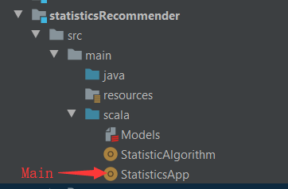
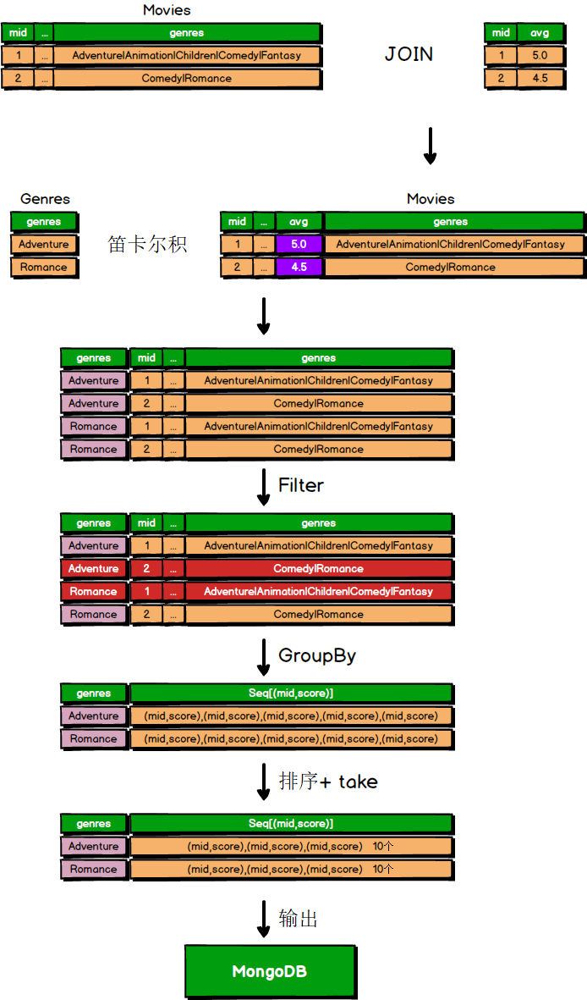

# **离线统计服务**

批处理统计性业务采用Spark Core + Spark SQL 进行实现，实现对指标类数据的统计任务。离线统计服务主要完成以下几个任务：

1. **评分最多电影**
    获取所有评分历史数据，计算评分次数，统计每个电影评分次数
2. **近期热门电影**
    按照月统计，这个月中评分最多的电影，我们认为是热门电影，统计每个月中每个电影的评分数量
3. **电影平均分**
    把每个电影，所有用户评分进行平均，计算出每个电影的平均评分 
4. **统计出每种类别电影Top10**
    将每种类别的电影中，评分最高的10个电影计算出来

### Code Structure



#### 评分最多的电影(StatisticAlgorithm.rateRank)

```scala
spark.sql("select mid, count(1) as count from ratings group by mid order by count desc")
```

#### **近期热门电影**(StatisticAlgorithm.rateRankByMonth)

```scala
// 先将timestamp 转化为年月的格式（yyyyMM）
val sdf = new SimpleDateFormat("yyyyMM")
spark.udf.register("convertTimestamp", (timeStamp: Long) => {
   sdf.format(new Date(timeStamp * 1000L))
})

val newRatings = spark.sql("select mid, score, convertTimestamp(timeStamp) as time from ratings")
```

```scala
// 通过日期进行group
newRatings.createOrReplaceTempView("newRatings")
val result = spark.sql("select mid, count(1) as count, time from newRatings group by mid, time order by time desc, count desc")
```

#### 电影平均分

```scala
spark.sql("select mid, avg(score) as avg from ratings group by mid")
```

#### **统计出每种类别电影Top10**(StatisticAlgorithm.rankMovieByGenre)



```scala
val result = genresRDD.cartesian(moviesWithScoreDF.rdd).filter {
    case (genre, row) => {
 row.getAs[String("genres").toLowerCase.contains(genre.toLowerCase)
    }
}
.map {
    case (genre, row) => {
    (genre, (row.getAs[Int]("mid"), row.getAs[Double]("avg")))
    }
}
.groupByKey()
.map {
     case (genre, items) => {
     GenresRecommendations(genre, items.toList.sortWith(_._2 > _._2).take(10).map(x => Recommendation(x._1, x._2)))
     }
}.toDF
```

